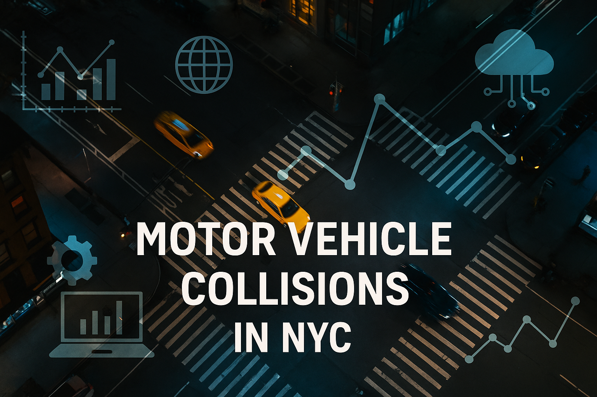

# 🚗 Motor Vehicle Collisions in NYC (2012–2023)
---

## 📌 Objective
Analyze and visualize motor vehicle collisions in New York City from 2012 to 2023 to:
- Identify major contributing factors to accidents.
- Correlate accidents with time, weather, and location.
- Offer insights for safer urban traffic management.

---

## 🗃️ Dataset
- **Primary Source**: NYC Motor Vehicle Collision Data (2012–2023) — ~1.9M records, 29 fields.
- **Weather Data**: Fetched using [open-meteo.com](https://open-meteo.com/).
- **Geolocation Data**: Enriched using [Nominatim API](https://nominatim.org/).

---

## 🔧 Data Processing Workflow

1. **Data Cleaning**
   - Handled missing values and invalid coordinates.
   - Used APIs to extrapolate borough and zip codes.

2. **Data Merging**
   - Merged collision data with weather data based on `crash_date` and `crash_time`.

3. **APIs Used**
   - Nominatim API for geolocation enrichment.
   - Open-Meteo API for weather enrichment.

4. **Performance Challenge**
   - Due to API rate limits and 1.3M+ requests, data processing required batching over several days.

---

## 📊 Key Insights

1. **Top Contributing Factors**
   - Driver distraction and aggressive driving were major causes.
   
2. **Temporal Trends**
   - Peak accidents during rush hours (7–8AM & 3–6PM).
   - Fridays saw the highest accident counts; Sundays the lowest.

3. **Geospatial Analysis**
   - Brooklyn recorded the highest number of incidents.
   - Hotspots: near intersections, hospitals, and landmarks.

4. **Weather Impact**
   - No significant correlation found between weather conditions and accident frequency.

5. **Severity by Cause**
   - Alcohol/drugs and blind spot scenarios led to higher casualties among pedestrians and cyclists.

---

## 📈 Visualizations
- Bar charts, heatmaps, and time-series plots.
- Tools: `Matplotlib`, `Seaborn`, `Plotly`.

---

## 📁 File Structure
```plaintext
.
├── Group12_Project_Motor_vehicle_collisions_sub.ipynb  # Main analysis notebook
├── Motor Vehicle Accidents.pdf                         # Full project report
├── Motor Vehicle Accidents.pptx                        # Project presentation slides
└── README.md                                           # (This file)
